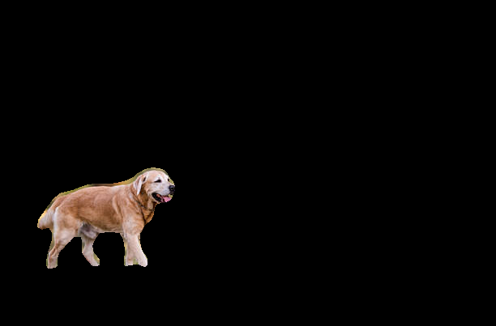
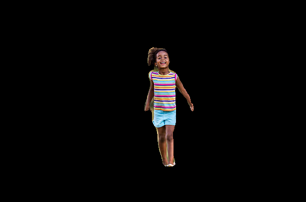
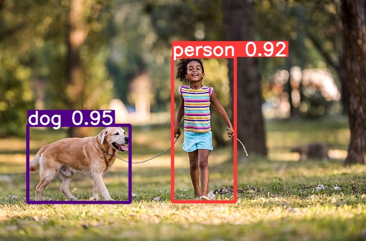

# Image Segmentation and Object Detection Project with Summarization

This project focuses on image segmentation, object detection, and text extraction using a combination of deep learning models such as FCN-ResNet50, YOLOv8, and EasyOCR. It also includes a MySQL database integration for storing metadata of segmented objects.

## Table of Contents
- [Project Overview](#project-overview)
  - [1. Image Segmentation](#1-image-segmentation)
  - [2. Object Detection](#2-object-detection)
  - [3. Saving Segmented Objects](#3-saving-segmented-objects)
  - [4. Text Extraction](#4-text-extraction)
  - [5. Summarization](#5-Summarization)

- [License](#license)

## Project Overview

This project integrates various components to achieve image segmentation, object detection, and text extraction, providing a comprehensive pipeline for processing and analyzing images.

### Components:
1. **Image Segmentation:** Using `fcn_resnet50` from `torchvision` to segment images.
2. **Object Detection:** Utilizing `YOLOv8` to detect objects within an image.
3. **Text Extraction:** Implementing `EasyOCR` for extracting text from images.
4. **Database Integration:** Storing metadata of segmented objects in a MySQL database.
5. **Summarization:** Based on the text extracted it provides summary of the objects.

### 1-image-segmentation
This module leverages the `FCN-ResNet50` model from `torchvision` to perform semantic segmentation on input images. The model segments the image into different classes, identifying objects, and separating them into distinct regions.
It creates masks for the objects present in the input image and then based on the mask it extracrts the objects and saves in into the database with unique ID to each object and master ID to main image.
#### `Here are some sample outputs of the segmented objects.`
##### Main Image and segmented mask

---

### 2-object-detection
Object detection is the process of identifying and localizing objects within an image. This section of the project involves using a YOLO model (You Only Look Once) to detect and classify objects in an image. The detected objects are highlighted with bounding boxes, and their corresponding class labels are displayed.

#### `Here are some sample outputs of the segmented objects.`

  
  

##### `YOLO object detectoin and localization.`

  

---

### 3-saving-segmented-objects
After extracting the objects from the image. Used MySql DataBase to create a table where each image is stored as a master ID and the extracted objects has their object IDs then these all are saved into a databse along with the path to the saved objects.

##### Sample table output

  

---

### 4-text-extraction
Once the objects are classified in the image, the labels and their confidence score are displayed on the image.  This image is saved and further fed into the text extraction model ,  Easyocr is used for extracting the text from the predicted image. The  these texts are saved into a list.

##### Output of the extracted text

  

---

### 5-Summarization
For summarization the extracted text is used.  The extracted text with their confidence score is fed into an LLM chain implemented using `LangChain`.  An prompt templet is created for summarization and the extracted text is passsed into it then it is compiled into a chain which is integrated with the LLM tio get the response.

##### Output of LLM

  

---

